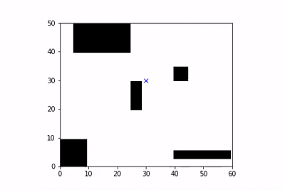
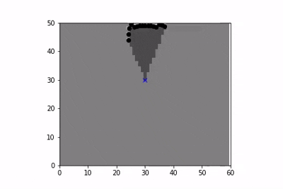
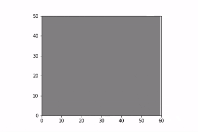

# Self Driving Cars – Motion Planning

This repository contains experiments and assignments related to self-driving car technologies, focusing on **motion planning** and **mapping**.

## 📄 Project: Occupancy Map Generation

The included Jupyter Notebook (`Motion_Planning/Occupancy_map_generation.ipynb`) demonstrates:

- Simulating a robot in a 2D grid environment.

- Using a LiDAR-based **inverse measurement model** to estimate cell occupancy.
- Updating a probabilistic occupancy grid map with the **log-odds** method.
- Visualizing:
  - The **true map** with robot trajectory.
  
  - The **inverse model** probability map.
  
  - The **belief map** as the robot explores.
   
